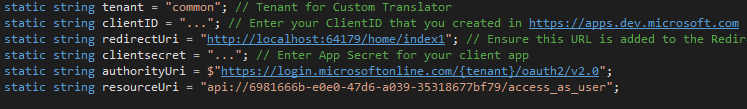
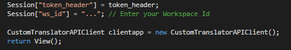
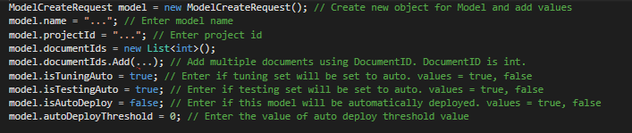
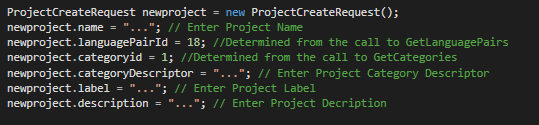
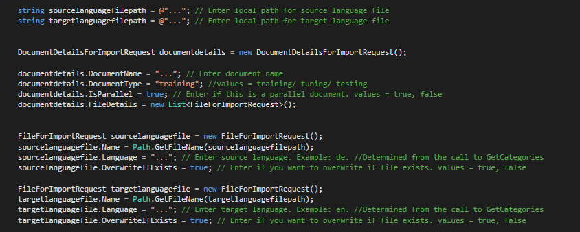
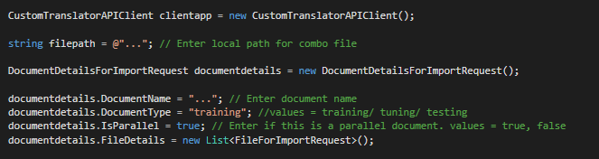

Setup MVC App Code
==================

Run Visual Studio, open CustomTranslatorSampleCode.sln and expand CustomTranslatorSampleCode.

In Controllers folder open **HomeController.cs**, and update following code:

1. **clientID**: update this value with the App Id/Client ID listed in Application Registration Portal.
2. **clientsecret**: update this value with your App’s secret/ password.
3. **redirectUri**: update it as per your MVC app’s URL.

4.  **session Session["ws_id"]**: update this variable based on your workspace ID.

In Controllers folder open **ModelController.cs**, go to **Create()** method and update following code:

1. **model.name**: update this value desired model name.
2. **model.projectId**: update this value with your project id.
3. **model.documentIds.Add()**: add document id in this list. You can add multiple documents.

In Controllers folder open **ProjectController.cs**, go to **Index()** method and update following code:

1. **newproject.name**: update this value desired project name.
2. **newproject.languagePairId**: update this value with appropriate language pair id.
3. **newproject.categoryid**: update this value with appropriate category id.
4. **newproject.categoryDescriptor**: update this value desired project category descriptor.
5. **newproject.label**: update this value desired project label.
6. **newproject.description**: update this value desired project description.

In Controllers folder open **UploadController.cs**, go to **ParallelFile()** method and update following code:

1. **sourcelanguagefilepath**: update this value of the local path for source language file.
2. **targetlanguagefilepath**: update this value of the local path for source target file.
3. **documentdetails.DocumentName**: update this value with desired document name.
4. **documentdetails.DocumentType**: update this value desired document type. Values can be of training/ tuning/ testing.
5. **sourcelanguagefile.Language**: update this value with source language code.
6. **sourcelanguagefile.OverwriteIfExists**: if you want to overwrite with this file, if the same file name exists use **true**, else use **false**.
7. **targetlanguagefile.Language**: update this value with target language code.
8. **targetlanguagefile.OverwriteIfExists**: if you want to overwrite with this file, if the same file name exists use **true**, else use **false**.

In Controllers folder open **UploadController.cs**, go to **ComboFile()** method and update following code:

1. **filepath**: update this value of the local path for combo file.
2. **documentdetails.DocumentName**: update this value with desired document name.
3. **documentdetails.DocumentType**: update this value desired document type. Values can be of training/ tuning/ testing.

Build the code and run it in Visual Studio to verify everything is working.
